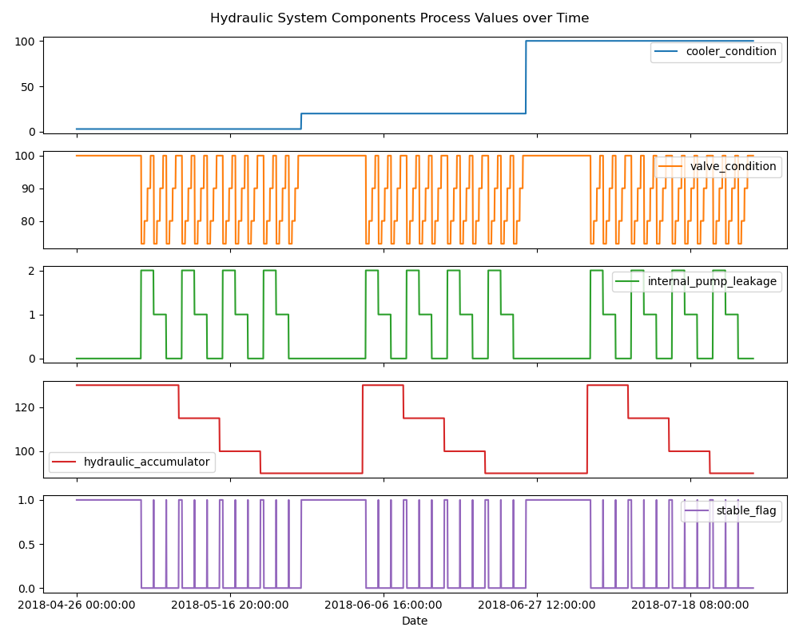
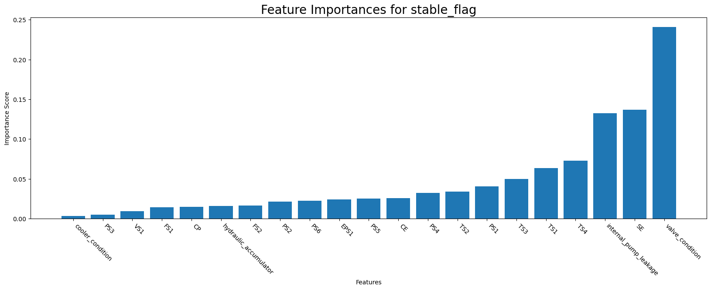

# **Manufacturing Oil Rig Hydraulic System Analysis**
## Background
The data set comes from a real hydraulic rig system. This hydraulic rig is used to drill oil out of the ground. The rig has sensors in different areas measuring the pressure, volumetric flows, and temperatures. It has 4 main controls: the cooler setting, the valve setting, the pump setting, and the accumulator setting. 

The original data set is from [UCI Machine Learning Repository](https://archive.ics.uci.edu/dataset/447/condition+monitoring+of+hydraulic+systems).

## Business Problem
The hydraulic system owned by EnergyMobil, an industrial manufacturing company (a fictitious company). The objective of this project is to create a classification model to predict the stability of a hydraulic system and determine what processes caused degradation.

## Approach
### Data Preparation
Original downloaded files from UCI Machine Learning Repository consist of dozen sensor data files and one proftile.txt for component values. The system cyclically repeats constant load cycles (duration 60 seconds) with various sampling rate from 1 Hz to 100 Hz. "Hydraulic Systems Data Prep.ipynb" is written to pick up useful data from raw files, combine all sensor data together, add Time and Date columns. Then sensor data and component value data were merged together as data source for following analysis.

### EDA - Exploratory Data Analysis
1. Use line charts to overview process values of four hydraulic components (cooler, valve, pump and accumulator). We can understand overall process degradation through these charts.

    

2. Histograms to check the distribution of sensor data (independent variables).
3. Boxplots to check for outliers of sensor data.
4. Pairplot to show pairwise relationship between sensor data.
5. Countplots for Component Value distributions.
6. Correalation matrix heatmap to compare sensor and component values correlation.
7. Determine feature importance on all sensor data and compoent values using randomforestclassifier for stability prediction. It helps us to understand feature importance, and serves as reference for feature selection techique used later in ML.

### ML - Random Forest Classification model to predict system stability
1. The stability of the hydraulic system is considered as a binary classification problem. Since we're working on both numerical data and categorical data, and prefer better interpretability, so randomforestclassifier become our choice to build classification model.
2. Preprocessing includes feature scaling for sensor data (numerical) and One-Hot Encoding for component values (categorical).
Since sensor data has quite a bit outliers, so we choose QuantileTransformer performs a non-linear transformation to spread out the most frequent values. It also reduces the impact of outliers that caused by failed system detection.
3. First train model and make prediction, classification report shows weighted avg f1-score of 0.977327.

4. Then conduct Hyperparameter tuning. RandomizedSearchCV is adopted to find the best model. Make another prediction using best model and classification report shows weighted avg f1-score increased 0.62% to 0.983359.

5. Apply feature selection to pick most relevant features and re-train the model again using selected features, weighted avg f1-score increased 1.08% to 0.987891.

## Findings and Recommendations
1. Out of 4 components, Valve condition and Internal pump leakage are top two significant factors affecting the stability of the hydraulic system. When valve condition is lagging or close to failure, or Internal pump leakage starts to occur, system's stability begins to decrease. Therefore, EngergyMobile should conduct regular inspections and maintenance of the valves, monitor internal pump leakages closely and resolve any leakages promptly in order to ensure system stability.
2. Difference sensor data various feature importance affecting system stability prediction. These features: ['EPS1', 'PS1', 'PS4', 'PS2', 'PS6', 'SE', 'TS1', 'TS2', 'TS3', 'TS4'] have weight in their affluence to the model. Suggest EngergyMobile to focus more on these sensors and underline system to prevent potential system instabilities.
3. Random Forest Classification model achieved 98.8% accuracy in predicting system stability. EnergyMobile can consider adopting this model for real time system stability monitoring and prediction to prevent future outage.

## Future Improvements
1. Use Recursive Feature Elimination to figure out the best feature selection.
2. Try different ML models such as SVM or Deep Learning models for more accurate prediction.
